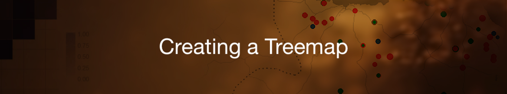
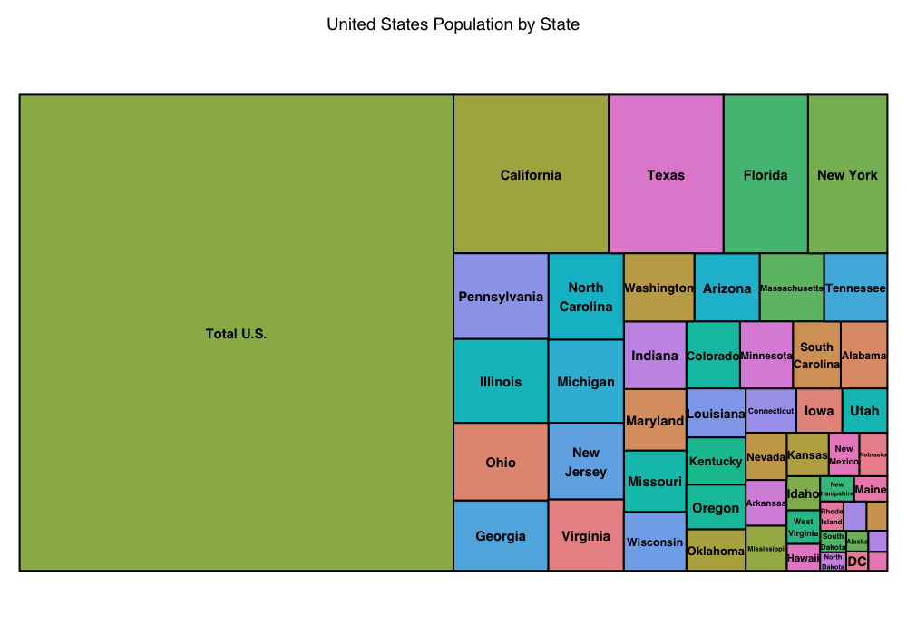
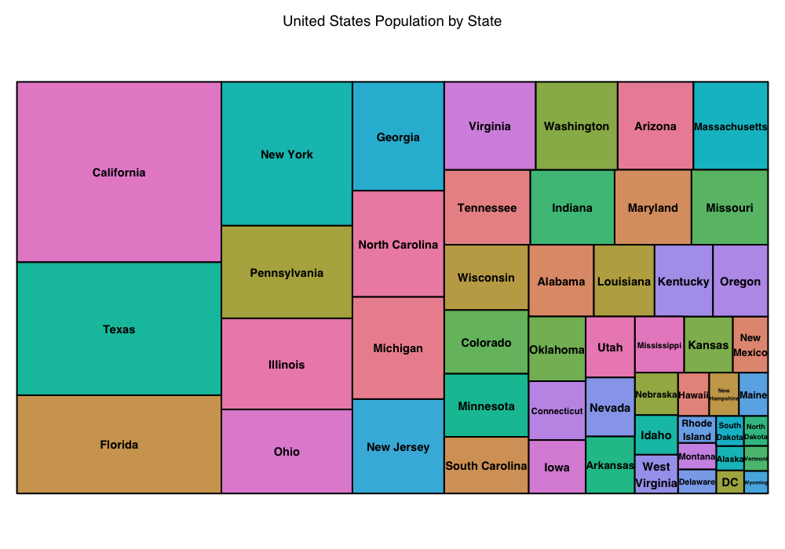
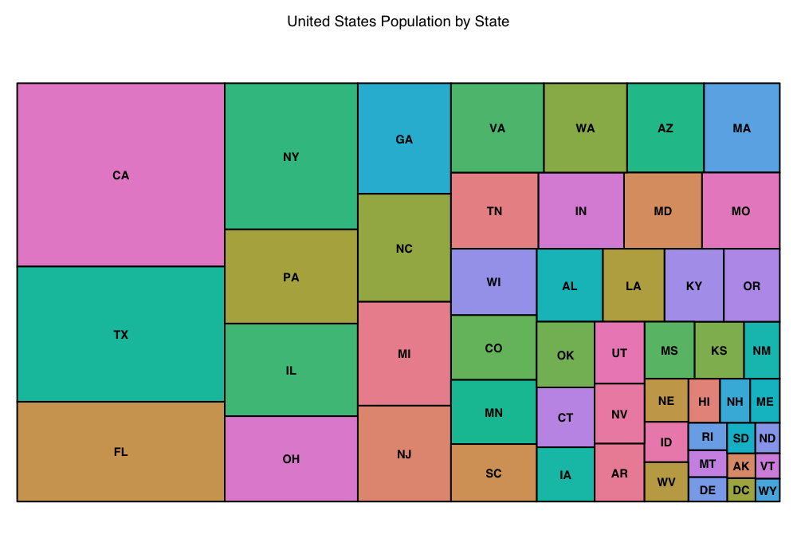

	

## Tutorial Aims:
#### 1.Develop a good understanding of Treemaps and how they are useful 
#### 2.Understand how to upload data into your R Studio 
#### 3.Be able to transform data into a Treemap
#### 4.Be able to change the appearance of a Treemap 

## Steps: 

#### <a href="#packages"> 1. Loading needed packages </a>

#### <a href="#data"> 2. Downloading data</a>

#### <a href=”#plot”> 3. Creating the Treemap</a>

#### <a href=”#change”> 4. Changing your Treemaps look</a> 

#### <a href=”#inter”> 5. Making your Treemap more interactive</a> 

#### <a href=”#more”> 6. More sources</a> 

## What is a Treemap?

In its most basic form, a Treemap is used to visualize proportions. Similar to a pie chart, a Treemap allows the reader to see different values as part of a whole, in this case a large rectangle instead of a circle. Treemaps are also super useful to display lots of information in a small amount of space. Using hierarchical Treemaps allow the plot to interactive and show different kinds of information. 

Treemaps can come in multiple forms ranging from very basic to very complex. Today you will be learning the most basic kind of Treemap and how to make it interactive. 

## 1. Loading needed packages

For this tutorial you will need 5 different packages. Copy the code below into your RStudio and run it to install and load the needed package. 

`install.packages("tidyverse")`

`install.packages("treemap")`

`install.packages("dplyr")`

`install.packages("readr")`

`install.packages("d3treeR")`

`devtools::install_github("timelyportfolio/d3treeR") # use this code if d3treeR does not install on the first try (remove the # to run this code)
`

Once you have installed these packages it is time to load them up. Use the code below to do that. 

`library(tidyverse)`

`library(treemap)`

`library(dplyr)`

`library(readr)`

`library(d3treeR)`

## 2. Downloading data

To get the needed data, [please visit this repository](https://github.com/EdDataScienceEES/tutorial-Hannalh14). Once you have copied the repo, please set your working directory to where you saved it on your device. Use the following code to set your working directory.

`setwd("You_file_path")`

The next step in this process is to load the data from the repo and view it in your RStudio. Use the code below to do that. 

`popdata <- read.csv("us_pop_by_state.csv")` 

`view(popdata)` 

An important thing to keep in mind if you decide to make a Treemap with your own data is to make sure your data is compatable. To make a Treemap you need to have hierarchical data.Sort of like a nesting doll or an onion, data with various layers wrok well when creating Treemaps. In this tutorial you with be working with very very simple data that have very few layers.W will be using the US states and their populations recorded from the 2020 census. Something else to keep in mind if you are to use this method with your own data is to make sure the data doesn't have a total sum of your values. For example, the entire population of the US. This total can throw off the proportions of your Treemap so it is best to get rid of it. 

Below you can see an example of a Treemap if we did not get rid of the whole population of the US. 

To avoid this, we need to get rid of this total in our data. That can be done with the code below. Note: this code does gets rid of the territory of Washington D.C. This data collect D.C. as its own district so we will be keeping it to make the data consistent.   

`statepop <- popdata %>% slice(-c(52))`
`view(statepop)`

As you can see when you view the data, the last row has been removed. 

This can also be relevant with observational data, you do not want a row that contains a sum of all of your observations. 

## 3. Creating the Treemap
Now that our data is all sorted, it is time to create the Treemap. First, it is good to have an understanding of the code you will be running. We will be using the Treemap package you downloaded at the beginning of this tutorial. As you can see in the code you are going to run below, you must call both the Treemap package and the data that we sliced above. Some other important aspects to understand are what pieces of the data youa re using to create this plot."Index" is referring to the characters we are comparing, in this case it will be the US states. "vSize" is the numerical values we are comparing, in this instance it is the population from the 2020 census. Next is "type" that is just determining the color scheme used in the Treemap. Lastly, is title which is pretty self explanitory. 

The code below will result in your first Treemap! Try it out! 

poptm <- treemap(statepop,

                  index = c("state"),
                  
                  vSize = "X2020_census",
                  
                  type= "index",
                  
                  title = "United States Population by State")
                  
You should have gotten something that looks like this. 

With all of those names of those states the Treemap has gotten a little crowded. something you want to ensure when making a Treemap is that it is legible, this means both the identifiers (the states names), and the visual proportions are easy to read. In the dataset you have retrieved there is another way to identify these states that is a better visualization of the data. Try the code below to see this new map. 

abvtm <- treemap(statepop,
                 
                 index = c("state_code"),
                 
                 vSize = "X2020_census",
                 
                 type = "index",
                 
                 title = "United States Population by State")
`
You should see something like this.

## 4. Changing your Treemaps look 

Like all plots, the most fun part about creating them is being able to make them look really nice and fun! Below is the code for a similar map to before with some different aspects changed. There are many different color palettes to choose from, check out [this link](https://www.datanovia.com/en/blog/the-a-z-of-rcolorbrewer-palette/#:~:text=RColorBrewer%20is%20an%20R%20package,Install%20and%20load%20RcolorBrewer%20package) for some palette inspiration, or try your hand at making your own color palette!   

The code below changes the color palette and also secures the font and border colors for this Treemap. Give it a go!

tmcolorp <- treemap(statepop,
                   
                   index = c("state_code"),
                   
                   vSize = "X2020_census",
                   
                   type = "index",
                   
                   title = "United States Population by State",
                   
                   palette = "Spectral",
                   
                   border.col = "black",
                   
                   fontcolor.labels = "black")

## 5. Making your Treemap interactive

Treemaps have the potential to be very complex and elaborate. Today we made a very basic Treemap, but that doesn't mean we can't spruce it up just a little but more and make it more informative. The code below uses a package called "d3treeR", this package allows you to make interactive Treemaps. This allows your Treemap to have more information and still look neat on the outside. To see more of these interactive Treemaps, please see the reading below. 

Give this code a try!

United_States_Population_by_State <- tmcolorp #This renames the previous plot so it will show up as the heading.

d3tree2(United_States_Population_by_State)

As you can see the actual populations of each state show up when you put your curser over the states section. This interactive feature would work even better with dense hierarchical data. If you wish to explore this feature more check out these two sources! Using [Plotly](https://plotly.com/r/treemaps/) and using [d3tree](https://d3-graph-gallery.com/treemap.html)   

## Learn more with these sources!

[More basics of Treemaps](https://r-graph-gallery.com/236-custom-your-treemap)

[Treemap reading](https://www.r-bloggers.com/2018/09/simple-steps-to-create-treemap-in-r/)

[Why Treemaps are better than pie charts](https://www.data-to-viz.com/caveat/pie.html)

[link to tutorial website here](https://github.com/Hannalh14/CreatingTreemaps)

