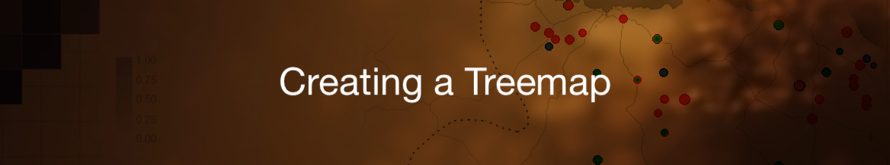

	
	

### Tutorial Aims:
#### Develop a good understanding of Treemaps and how they are useful 
#### Understand how to upload data into your R Studio 
#### Be able to transform data into a Treemap
#### Be able to change the appearance of a Treemap 

### Steps: 

#### <a href="#packages"> 1. Loading needed Packages </a>

#### <a href="#data"> 2. Downloading data</a>

#### <a href=”#plot”> 3. Creating the Treemap</a>

#### <a href=”#change”> 4. Changing your Treemaps look</a> 

#### <a href=”#more”> 5. More sources</a> 
